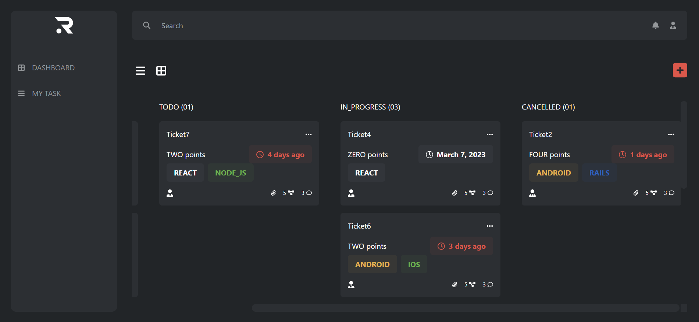
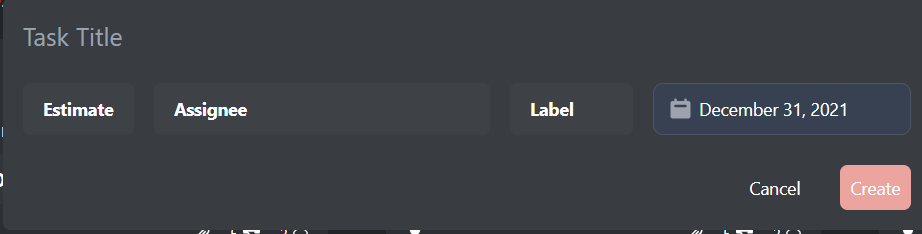
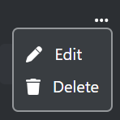

# RAVN - Task Management Challenge

This is a partial solution to the Task Management Challenge for the Junior Trainee Position on Rvn. Ravn is a seasoned team of digital architects, software developers, technical designers and project managers that deliver engaging experiences users love.

**Table of Contents**
- [RAVN - Task Management Challenge](#ravn---task-management-challenge)
- [Setup](#setup)
- [Project Description](#project-description)
- [Project Structure](#project-structure)
- [Application](#application)
- [Technologies \&\& Libraries](#technologies--libraries)
    - [End](#end)

# Setup
To get started, clone the repository or download. Then, navigate to the project directory in the terminal and run the following command to install the required dependencies:

`$ npm install`

Once the dependencies are installed, run the following command to start the development server:

`$ npm run dev`

This will start the development server then press h and o to open the app in your default browser.

# Project Description
This is a coding challenge to create a Task Management App. In the application you shoul be able to visualize, create, delete and edit tasks.

# Project Structure

The project is structured as follows:

```bash
D:.
├─dist
│  └─assets
├─node_modules
├─public
└─src
    ├─assets
    ├─components
    │  ├─Capsule
    │  ├─Card
    │  ├─hooks
    │  └─modal
    ├─graphql
    │  ├─mutations
    │  └─queries
    └─types
```

# Application
The application looks like this:

- Init
  

- Add Task Modal
  

- Edit Card Modal </br>
  

A demo of the application can be found here:
`Demo` : https://theonlylooker.github.io/rvn-challenge/

# Technologies && Libraries
The application was made using the follow technologies:

- Front-End
  - ReactJS
  - TailwindCSS
  - FontAwesomeIcons
- Back-End
  - GraphQL
  - Apollo
- Deploy
  - Github Pages
- Libraries
  - Tailwind-datepicker-react

### End
